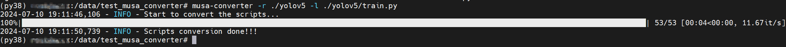

基于musa_converter工具自动迁移
====================================

musa_converter工具介绍
------------------------------

musa_converter是torch_musa开发者提供的一个可以将能够在CUDA平台上运行的原生PyTorch训练/推理脚本转化为能够在MUSA平台上直接运行的一键式转换工具。

用户可以在命令行执行 `musa_converter -h` 查看使用说明，各个参数及其描述如下。 

.. list-table::

    *   -   输入参数
        -   描述
    *   -   -r, --root_path
        -   待转换脚本的根路径，可以是文件或者目录
    *   -   -l, --launch_path
        -   训练或推理的启动脚本路径（python文件），当指定该路径时，转换工具会自动添加 `import torch_musa` 到文件中
    *   -   -e, --excluded_path
        -   不想包含在转换过程中的文件路径，可以是一个或多个路径，以逗号分隔

使用musa_converter迁移YOLOv5
------------------------------

在命令行中运行 `musa-converter -r ./yolov5 -l ./yolov5/train.py` 可以看到如图所示输出即表示转换完成。

之后用户便可以基于torch_musa进行YOLOv5的单卡和多卡训练测试。

.. attention::
    由于在转换过程中会直接修改源文件，推荐在运行转换工具前将代码提前备份。

.. note::
    musa_converter工具属于实验特性，用户在使用中遇到任何问题可以提出issue到 `torch_musa Github <https://github.com/MooreThreads/torch_musa/issues>`_ 页面。
