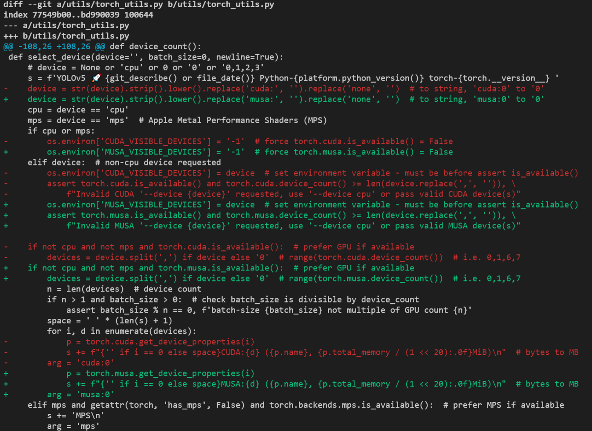
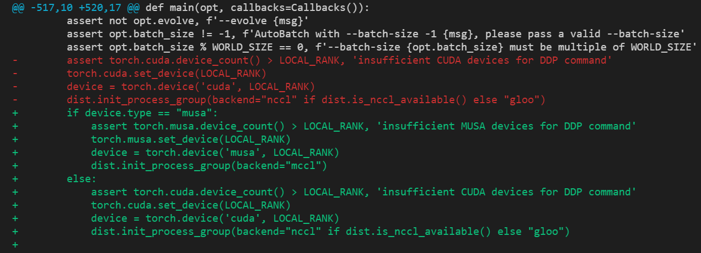
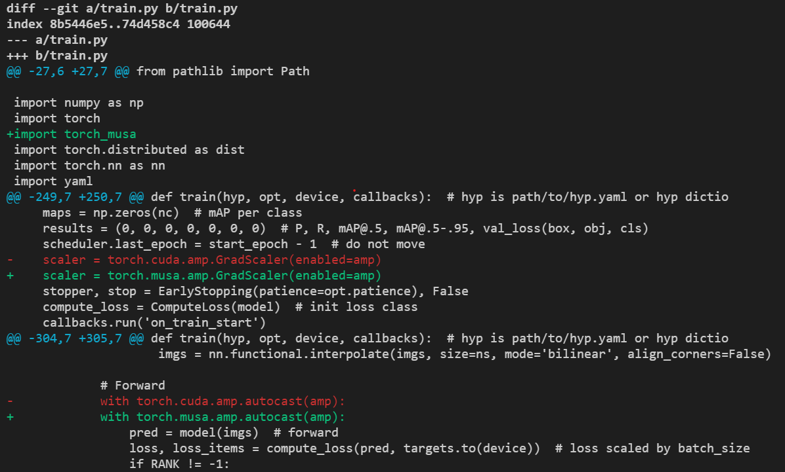
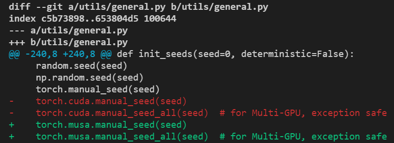
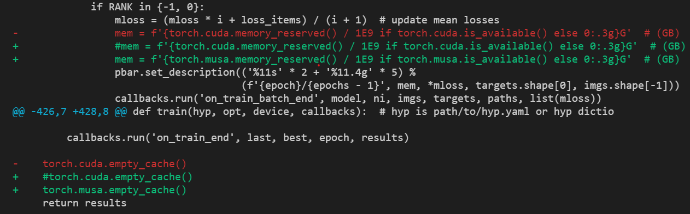

手动修改代码迁移
====================================

首先需要在训练脚本（本例中为 `train.py` 文件）中的 `import torch <https://github.com/ultralytics/yolov5/blob/v7.0/train.py#L29>`_ 下一行 添加 `import torch_musa` ，之后大部分情况下只需要将代码中的cuda或CUDA字符串修改为musa或MUSA，nccl修改为mccl即可。主要包含对模型训练代码中device设置（如CPU/CUDA/MUSA）、DDP通信后端设置（如nccl/mccl）、混合精度训练设置和随机数种子设置等部分代码的修改。

device设置
------------------------------

修改 `utils/torch_utils.py` 文件中 `select_device <https://github.com/ultralytics/yolov5/blob/v7.0/utils/torch_utils.py#L108>`_ 函数，将CUDA/cuda相关字符串修改为MUSA/musa，修改前后代码改动如下图所示。

DDP通信后端设置
------------------------------

修改 `train.py` 中DDP初始化 `相关代码 <https://github.com/ultralytics/yolov5/blob/v7.0/train.py#L520-L523>`_ ，将通信后端由nccl修改为mccl，修改前后代码改动如下图所示。

混合精度训练设置
------------------------------

PyTorch提供了混合精度训练的两个python前端接口autocast和GradScaler，因此只需要将cuda接口修改为torch_musa的接口即可。本例中需要将 `train.py` 中的 `torch.cuda.amp.autocast <https://github.com/ultralytics/yolov5/blob/v7.0/train.py#L307>`_ 修改为torch.musa.amp.autocast或torch_musa.amp.autocast；将 `torch.cuda.amp.GradScaler <https://github.com/ultralytics/yolov5/blob/v7.0/train.py#L252>`_ 修改为torch.musa.amp.GradScaler或torch_musa.amp.GradScaler，修改前后代码改动如下图所示。

然后将 `models/common.py` 文件 `第26行 <https://github.com/ultralytics/yolov5/blob/v7.0/models/common.py#L26>`_ 的 `from torch.cuda import amp` 修改为 `from torch_musa import amp` 。

随机数种子设置
------------------------------

PyTorch中可以使用torch.cuda.manual_seed()及torch.cuda.manual_seed_all()在一定程度上保证算法在CUDA上的可复现性，类似的，使用torch_musa时可以通过torch.musa.manual_seed()及torch.musa.manual_seed_all()在摩尔线程GPU上达到同样的效果，对YOLOv5中随机数种子相关代码（ `utils/general.py文件 <https://github.com/ultralytics/yolov5/blob/v7.0/utils/general.py#L243-L244>`_ ）修改如下图：

其他
------------------------------

除以上修改外还需要修改train.py文件中 `memory相关接口 <https://github.com/ultralytics/yolov5/blob/v7.0/train.py#L332>`_ ，具体修改如下图所示。

完成以上修改后可执行如下命令测试YOLOv5在摩尔线程GPU上的单机单卡和单机八卡训练。

.. code-block:: python

    # 单机单卡
    python train.py --data data/coco.yaml --weights '' --cfg models/yolov5m.yaml --batch-size 16 --device 0

    # 单机八卡
    python -m torch.distributed.run --nproc_per_node 8 train.py --data data/coco.yaml --weights '' --cfg models/yolov5m.yaml --batch-size 128 --device 0,1,2,3,4,5,6,7

