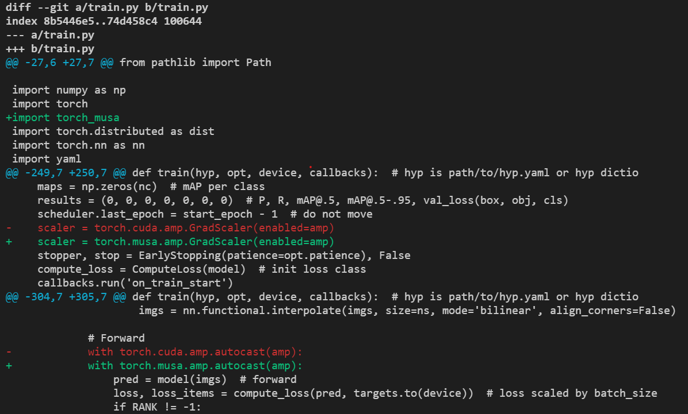
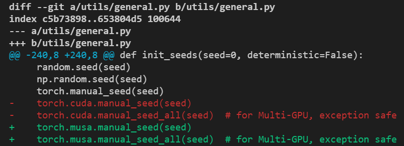
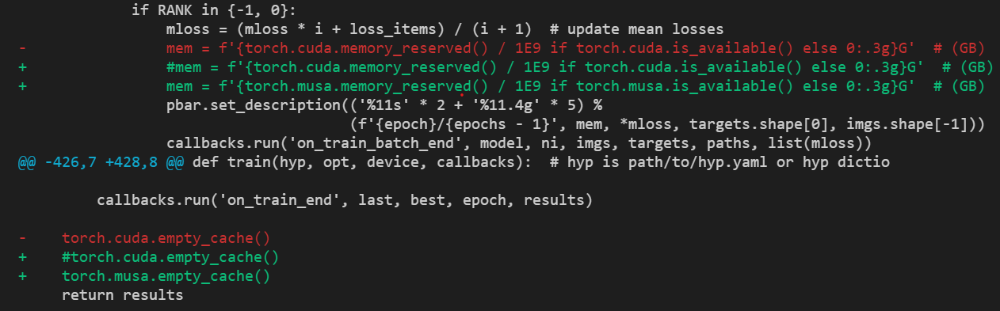

# 经典模型YOLOv5迁移示例

本节以 YOLOv5 为例，介绍如何将开源社区中能够跑在 CUDA 上的深度学习模型训练代码加以修改，使其能够运行在摩尔线程 GPU 上。使用的代码为 [ultralytics/yolov5](https://github.com/ultralytics/yolov5/tree/v7.0)。

## 手动修改代码迁移

首先需要在训练脚本（本例中为 train.py 文件）中的 [import torch](https://github.com/ultralytics/yolov5/blob/v7.0/train.py#L29) 下一行 添加 import torch_musa ，之后大部分情况下只需要将代码中的cuda或CUDA字符串修改为musa或MUSA，nccl修改为mccl即可。主要包含对模型训练代码中device设置（如CPU/CUDA/MUSA）、DDP通信后端设置（如nccl/mccl）、混合精度训练设置和随机数种子设置等部分代码的修改。

### device 设置

修改 utils/torch_utils.py 文件中 [select_device](https://github.com/ultralytics/yolov5/blob/v7.0/utils/torch_utils.py#L108) 函数，将CUDA/cuda相关字符串修改为MUSA/musa，修改前后代码改动如下图所示。


### DDP 通信后端设置

修改 train.py 中DDP初始化 [相关代码](https://github.com/ultralytics/yolov5/blob/v7.0/train.py#L520-L523) ，将通信后端由nccl修改为mccl，修改前后代码改动如下图所示。


### 混合精度训练设置

PyTorch 提供了混合精度训练的两个 python 前端接口 autocast 和 GradScaler ，因此只需要将 cuda 接口修改为 torch_musa 的接口即可。本例中需要将 train.py 中的 [torch.cuda.amp.autocast](https://github.com/ultralytics/yolov5/blob/v7.0/train.py#L307) 修改为 torch.musa.amp.autocast 或 torch_musa.amp.autocast ；将 [torch.cuda.amp.GradScaler](https://github.com/ultralytics/yolov5/blob/v7.0/train.py#L252) 修改为 torch.musa.amp.GradScaler 或 torch_musa.amp.GradScaler ，修改前后代码改动如下图所示。



然后将 models/common.py 文件 [第26行](https://github.com/ultralytics/yolov5/blob/v7.0/models/common.py#L26) 的 from torch.cuda import amp 修改为 from torch_musa import amp 。

### 随机数种子设置

PyTorch中可以使用torch.cuda.manual_seed()及torch.cuda.manual_seed_all()在一定程度上保证算法在CUDA上的可复现性，类似的，使用torch_musa时可以通过torch.musa.manual_seed()及torch.musa.manual_seed_all()在摩尔线程GPU上达到同样的效果，对YOLOv5中随机数种子相关代码（ [utils/general.py文件](https://github.com/ultralytics/yolov5/blob/v7.0/utils/general.py#L243-L244) ）修改如下图：



### 其他

除以上修改外还需要修改train.py文件中 [memory相关接口](https://github.com/ultralytics/yolov5/blob/v7.0/train.py#L332) ，具体修改如下图所示。



完成以上修改后可执行如下命令测试YOLOv5在摩尔线程GPU上的单机单卡和单机八卡训练。

```shell
# 单机单卡
python train.py --data data/coco.yaml --weights '' --cfg models/yolov5m.yaml --batch-size 16 --device 0

# 单机八卡
python -m torch.distributed.run --nproc_per_node 8 train.py --data data/coco.yaml --weights '' --cfg models/yolov5m.yaml --batch-size 128 --device 0,1,2,3,4,5,6,7
```

## 基于 musa_converter 工具自动迁移

### musa_converter 工具介绍

musa_converter 是 torch_musa 开发者提供的一个可以将能够在 CUDA 平台上运行的原生 PyTorch 训练/推理脚本转化为能够在 MUSA 平台上直接运行的一键式转换工具。

用户可以在命令行执行 `musa_converter -h `查看使用说明，各个参数及其描述如下。

| 输入参数               | 描述                                                                |
|:------------------ |:----------------------------------------------------------------- |
| -r，--root_path     | 待转换脚本的根路径，可以是文件或者目录                                               |
| -l，--launch_path   | 训练或推理的启动脚本路径（python文件），当指定该路径时，转换工具会自动添加 `import torch_musa` 到文件中 |
| -e，--excluted_path | 不想包含在转换过程中的文件路径，可以是一个或多个路径，以逗号分隔                                  |

### 使用 musa_converter 迁移 YOLOv5

在命令行中运行 `musa-converter -r ./yolov5 -l ./yolov5/train.py` 可以看到如图所示输出即表示转换完成。


之后用户便可以基于torch_musa进行YOLOv5的单卡和多卡训练测试。

:::warning 注意：

由于在转换过程中会直接修改源文件，推荐在运行转换工具前将代码提前备份。

:::

:::info 注解：

musa_converter工具属于实验特性，用户在使用中遇到任何问题可以提出issue到 [torch_musa Github](https://github.com/MooreThreads/torch_musa/issues) 页面。

:::