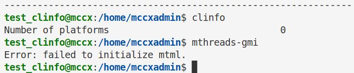
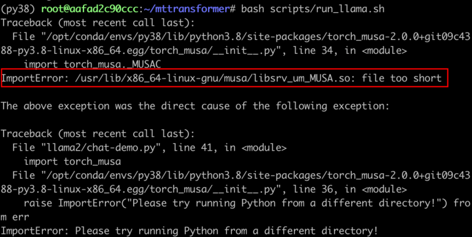
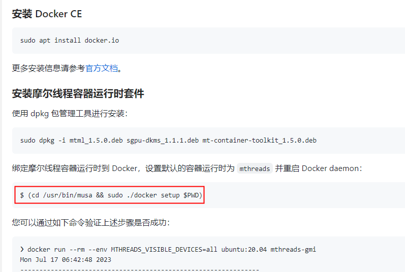

# FAQ

## 设备查看问题

Q：如果在安装完驱动后，普通用户（非 root 用户）无法查看显卡，使用 sudo 权限才可以查看显卡？



将该用户添加进 render group 后即可。

1. 如果环境中已经有 render group，执行下述命令即可：
   
   ```shell
   sudo usermod -aG render `whoami`
   ```

2. 如果环境中没有 render group，执行下述命令即可：
   
   ```shell
   sudo groupadd -o -g 109 render
   sudo usermod -aG render `whoami`
   ```

## 计算库无法找到

Q：如果在安装 torch_musa wheel 包后，`import torch_musa` 时报错无法找到 mudnn.so 库？


1. 请确认 /usr/local/musa/lib/ 目录下是否有该库，如果没有的话，需要安装该数学库；如果有的话，需要执行：
   
   ```shell
   export LD_LIBRARY_PATH=$LD_LIBRARY_PATH:/usr/local/musa/lib
   ```

## 编译安装

Q：如果在更新过 torch_musa 最新代码后，编译报错？

1. 请尝试
   
   ```shell
   python setup.py clean
   bash build.sh # 整体重新编译
   ```
   
   如果还报错，可能是因为需要更新 MUSA 软件栈中某个底层软件包。

## Docker 容器

Q：如果在docker container内部使用torch_musa时，报错 `ImportError: libsrv_um_MUSA.so: cannot open shared object file: No such file or directory` 或者 `ImportError: /usr/lib/x86_64-linux-gnu/musa/libsrv_um_MUSA.so: file too short` ？



1. 请确保成功安装mt-container-toolkit，安装步骤可以参考 [mt-container-toolkit文档](https://mcconline.mthreads.com/software/1?id=1) ; 请务必注意下面两点：
- 绑定摩尔线程容器运行时到 Docker，执行下图中红框中命令：



- 在启动 docker container 时请添加 `--env MTHREADS_VISIBLE_DEVICES=all` 。

## 适配算子

Q：如果在CUDA-Porting适配新算子时，编译可以通过，在 `import torch;import torch_musa` 时报错找不到符号?


1. 先用 c++filt 查看符号名称。

2. 在 PyTorch 源码中 grep 搜索这个符号：
- 如果该符号定义在cu文件中，那么把该cu文件对应的\*\*\*\*.mu文件加入到torch_musa/csrc/CMakeList.txt中即可。

- 如果该符号定义在cpp文件中，那么这是一个bug，请向torch_musa提交一个issue。

- 如果PyTorch中也没有这个符号，那么请在 `/usr/local/musa/` 中去grep搜索这个符号，这个符号可能是底层库定义的。
  
  - 如果找到这个符号，那么请检查是否没有链接这个底层库，查看命令可参考 `ldd path/to/site-packages/torch_musa-2.0.0-py3.8-linux-x86_64.egg/torch_musa/lib/libmusa_kernels.so`
  
  - 如果找到这个符号，且已经链接了对应底层库，可能底层库只暴露了这个符号，但是还未给出定义。如果是底层库暴露符号，但是porting的算子实际运行时没有调用符号，那么我们可以在torch_musa中定义一个空的实现，参考 `torch_musa/csrc/aten/ops/musa/unimplemented_functions.cpp` 。如果底层库暴露符号，porting的算子实际运行需要调用这个符号，那么可以给底层库提交需求。
3. 如果上面都没有找到上述符号，可以在CUDA PyTorch环境中下grep搜索一下，看看CUDA环境中这个符号定义在哪里，再和对应MUSA软件模块提交需求。

## 问题与反馈

如果在开发或者使用torch_musa的过程中，遇到任何bug或者没支持的特性，请积极向[torch_musa](https://github.mthreads.com/mthreads/torch_musa/issues)提交issue，我们会及时作出反馈。提交issue时，请给出复现问题的代码，报错log，并且打上对应的标签，如下面例子所示：


