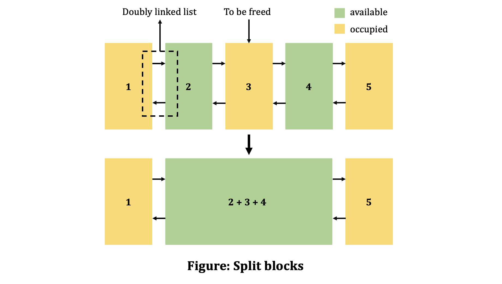

# Caching Allocator for MUSA

This allocator is designed in the same way as CUDA Caching Allocator.

## Basic Design

There is only one allocator for devices (need multiple allocators to support multi-gpu memory management). It is derived from `at::Allocator` so that all the tensors with dispatch key `at::musa::kMUSA` will call `malloc` and `free` func in this allocator.<br></br>
The implementation of allocator can be find in file `Allocator.cpp`.

### Data stuctures

The memory is managed in a data structure `Block`. Once some memory is allocated from `musaMalloc()`, all related info will be stored in a `Block` and be managed by the allocator.

```c++
struct Block {
  int device; // gpu
  size_t size; // block size in bytes
  BlockPool* pool; // owning memory pool
  void* ptr; // memory address
  bool allocated; // in-use flag
  Block* prev; // prev block if split from a larger allocation
  Block* next; // next block if split from a larger allocation
  int gc_count; // counter for prioritizing older / less useful blocks for
                // garbage collection
};
```

The `Block`s are managed in 2 ways:

- A general memory pool implemented in red-black tree, to efficiently find/insert a block with proper size.
- A doubly linked list, to connect `Block`s which have contiguous memory address.

In `Block`'s structure, `BlockPool* pool` is the general memory pool, and `Block* prev, next` indicates the doubly linked list.

### What happens when `malloc` being called

When user calls `malloc`, the allocator will do the following trails to return an available `Block`:

1. Try to find a proper empty block in the memory pool, if fails, try to manually do GC then try finding again. (L406-L410)
2. If 1. fails, we try to call driver API to allocate a new block. (L421, alloc_block() func)
3. If 2. fails, try to free some large empty blocks in the pool, and call musaMalloc again. (L424-L425)
4. If 3. fails, free all empty blocks in the pool and call musaMalloc again. (L427)

If all above have failed, the allocator will report an OOM similar to CUDA OOM.

### Key feature: split

The split feature is designed to mitigate the influence of memory fragments. It brings about 2 modifications:

- When allocate new memory via `musaMalloc()`, a larger size is allocated than the requested one.
- Whenever a larger block is assigned to the user (no matter managed by pool or allocated by `musaMalloc`), the block will be split into 2 parts (requested_size + remaining_size), and connect them by a doubly linked list (the second way to manage `Block`s).

When `free` is called, not only the specified block is freed (recycled), the neighbors in the linked list will be checked. If the neighbor(s) are available (not occupied), the freed block and the contiguous available neighber(s) are combined into a larger available block without changing those blocks' position in the doubly linked list. Let's see this example.



In the example above, when block 3 is freed, since block 2 and block 4 are available, they will be combined into block (2 + 3 + 4), while the connection between block 1 and block 5 will not change.

## TODO

1. - [ ] Add members and functions to support MUSA graphs, events and streams.
2. - [ ] Modify block-related hyper-params to fit MTGPU (need experiments).
3. - [ ] Add a allocator-vector to manage multiple devices.

