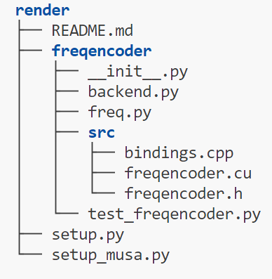
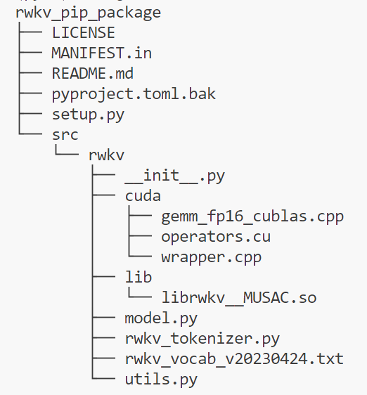

# torch_musa utils

<!-- toc -->
- [MUSAExtension](#musaextension)
- [LOGGER](#logger)
- [CMakeListsGenerator](#cmakelistsgenerator)
- [SimplePorting](#simpleporting)
- [CompareTool](#comparetool)
<!-- tocstop -->

## MUSAExtension
MUSAExtension is a function that helps third-party libraries build MUSA extensions. What it differs from CUDAExtension is that it keeps the consistent interface with [CppExtension](https://pytorch.org/docs/stable/cpp_extension.html#torch.utils.cpp_extension.CppExtension) so parameter `extra_compile_args` is a list instead of a dict. Unlike nvcc, it is not conveniently to integrate mcc (MUSA Compiler Collection) into MUSAExtension. But **CMake** which is from [pytorch/tools/setup_helpers/cmake.py](https://github.com/pytorch/pytorch/blob/main/tools/setup_helpers/cmake.py) can be utilized to facilitate the mcc compiling part.
```
from torch_musa.utils.musa_extension import MUSAExtension

# ext_module is an instance of torch.utils.cpp_extension.CppExtension
ext_module = MUSAExtension(name, sources, *args, **kwargs)
```
There is a simple MUSAExtension example which has the following catalogue structure:



And the content of `setup_musa.py` is:
```
import os
from setuptools import setup, find_packages
from torch_musa.utils.simple_porting import SimplePorting
from torch_musa.utils.musa_extension import MUSAExtension

c_flags = []
if os.name == "posix":
    c_flags = ['-O3', '-std=c++14']

# porting .cu to .mu
SimplePorting(cuda_dir_path="freqencoder/src", mapping_rule={
    "x.device().is_cuda()": "true",
    "#include <ATen/cuda/CUDAContext.h>": "#include \"torch_musa/csrc/aten/musa/MUSAContext.h\"",
    "#include <c10/cuda/CUDAGuard.h>": "#include \"torch_musa/csrc/core/MUSAGuard.h\"",
    }).run()

setup(
    name='freqencoder', # package name, import this to use python API
    ext_modules=[
        MUSAExtension(
            name='freqencoder._MUSAC', # extension name, import this to use MUSA API
            sources=[os.path.join('freqencoder/src_musa', f) for f in [
                'freqencoder.mu',
                'bindings.cpp',
            ]],
            extra_compile_args=c_flags
        ),
    ],
    package_dir={"": "../render"},
    packages=find_packages(where="../render", exclude=["build"]),
    package_data={
        "freqencoder": [
            "lib/*.so*",
        ]
    }
)
```

Another example has the following catalogue structure:



We can see `setup.py` is not located at the same level with package but `MUSAExtension` can handle this situation. That is, it will copy the generated shared object to `rwkv/lib/`. In addition, the generated shared object should be also packed when we install the package. Hence there are two recommended ways:
#### First way, set `package_data`, `package_dir` and `packages` in `setup` function like the following:

The conten of `setup.py` is:
```
import os
from setuptools import setup, find_packages
from torch_musa.utils.simple_porting import SimplePorting
from torch_musa.utils.musa_extension import MUSAExtension


c_flags = []
if os.name == "posix":
    c_flags = ['-O3', '-std=c++14']

# porting .cu to .mu
SimplePorting(cuda_dir_path="/home/ChatRWKV/rwkv_pip_package/src/rwkv/cuda",
            mapping_rule={
                "WITH_CUDA": "WITH_MUSA",
                "#include <ATen/cuda/CUDAContext.h>": "#include \"torch_musa/csrc/aten/musa/MUSAContext.h\"",
                "#include <c10/cuda/CUDAGuard.h>": "#include \"torch_musa/csrc/core/MUSAGuard.h\"",
                "::cuda::": "::musa::",
                "/cuda/": "/musa/",
                ", CUDA,": ", PrivateUse1,",
                "_CUDA_": "_MUSA_",
                ".cuh": ".muh",
                ".is_cuda()": ".is_privateuseone()",
                "cublas": "mublas",
                "CUBLAS": "MUBLAS"
                }
                ).run()

setup(
    name='rwkv', # package name, import this to use python API
    ext_modules=[
        MUSAExtension(
            name='rwkv._MUSAC', # extension name, import this to use MUSA API
            sources=[os.path.join("src/rwkv", 'cuda_musa', f) for f in [
                # 'gemm_fp16_cublas.cpp',
                'operators.mu',
                'wrapper.cpp',
            ]],
            define_macros=[('DISABLE_MUBLAS_GEMM', None)],
            extra_compile_args=c_flags
        ),
    ],
    package_dir={"": "src"},
    packages=find_packages(where="src", exclude=["build"]),
    package_data={
        "rwkv": [
        "lib/*.so*",
        ]
    }
)
```
#### Second way, add a `MANIFEST.in` file and set `include_package_data=True`(***DO NOT mix with the first way***):

The content of `MANIFEST.in` of `rwkv` is:
```
include src/rwkv/cuda_musa/*
include src/rwkv/*.txt
include src/rwkv/lib/*.so
```

In `MANIFEST.in` of `torch_musa`, we can see the following: 
```
...
include torch_musa/lib/*.so*
...
```

```
# Setup
if __name__ == "__main__":
    dump_version()

    setup(
        name="torch_musa",
        version=version,
        description="A PyTorch backend extension for Moore Threads MUSA",
        url="https://github.mthreads.com/mthreads/torch_musa",
        author="Moore Threads PyTorch AI Dev Team",
        packages=find_packages(exclude=["tools", "tools*"]),
        ext_modules=configure_extension_build(),
        include_package_data=True,
        install_requires=install_requires,
        extras_require={},
        cmdclass={"build_ext": Build, "clean": Clean, "install": Install},
    )
```


## LOGGER
```
from torch_musa.utils.logger_util import LOGGER

LOGGER.debug('debug')
LOGGER.info('info')
LOGGER.warning('warn')
LOGGER.error('error')
LOGGER.critical('critical')
```
## CMakeListsGenerator
```
from torch_musa.utils.cmake_lists_generator import CMakeListsGenerator

CMakeListsGenerator(sources=["/path/to/xxx.mu", "/path/to/xxx.cpp"], include_dirs=["/path/to/include_dir"], link_libraries="/path/to/libxxx.so"]).generate()
```
## SimplePorting

```
python -m torch_musa.utils.simple_porting --cuda-dir-path cuda/
```

`SimplePorting` outputs the transformed files to `${cuda-dir-path}_musa` hence executing the above command will generate a directory named `cuda_musa`. Please refer to simple_porting.py if you want more customizations.

Full command maybe:

```
python -m torch_musa.utils.simple_porting --cuda-dir-path cuda/ --ignore-dir-paths ["csrc/npu"] --mapping-rule {"cuda":"musa"} --drop-default-mapping --mapping-dir-path mapping/
```

If under WIN os then {"cuda":"musa"} should be '{\\"cuda\\":\\"musa\\"}'

If you want to integrate it to your own code then can use it like this:

```
from torch_musa.utils.simple_porting import SimplePorting

SimplePorting(cuda_dir_path, mapping_rule, drop_default_mapping, mapping_dir_path).run()
```

## CompareTool
```
from torch_musa.utils.compare_tool import CompareWithCPU

with CompareCPU(atol=0.001, rtol=0.001, verbose=True):
    train(model)
```
output is like:
```
============================
torch._ops.aten...div.Tensor
....... input .........
0:  Tensor <shape=torch.Size([16, 3, 640, 640]), stride=(1228800, 409600, 640, 1), dtype=torch.float32, device=musa:0, size=19660800,>, 
1: 255, 

...... output ........
 Tensor <shape=torch.Size([16, 3, 640, 640]), stride=(1228800, 409600, 640, 1), dtype=torch.float32, device=musa:0, size=19660800,>

...... compare with cpu .......
torch._ops.aten...div.Tensor succeeds to pass CompareWithCPU test
<class 'models.yolo.DetectionModel'> forwading starts
<class 'models.common.Conv'> forwading starts
<class 'torch.nn.modules.conv.Conv2d'> forwading starts


============================
torch._ops.aten..._to_copy.default
....... input .........
0:  Tensor <shape=torch.Size([48, 3, 6, 6]), stride=(108, 1, 18, 3), dtype=torch.float32, device=musa:0, size=5184,>, 

...... output ........
 Tensor <shape=torch.Size([48, 3, 6, 6]), stride=(108, 1, 18, 3), dtype=torch.float16, device=musa:0, size=5184,>

...... compare with cpu .......
torch._ops.aten..._to_copy.default succeeds to pass CompareWithCPU test


============================
torch._ops.aten..._to_copy.default
....... input .........
0:  Tensor <shape=torch.Size([16, 3, 640, 640]), stride=(1228800, 409600, 640, 1), dtype=torch.float32, device=musa:0, size=19660800,>, 

...... output ........
 Tensor <shape=torch.Size([16, 3, 640, 640]), stride=(1228800, 409600, 640, 1), dtype=torch.float16, device=musa:0, size=19660800,>

...... compare with cpu .......
torch._ops.aten..._to_copy.default succeeds to pass CompareWithCPU test


============================
torch._ops.aten...convolution.default
....... input .........
0:  Tensor <shape=torch.Size([16, 3, 640, 640]), stride=(1228800, 409600, 640, 1), dtype=torch.float16, device=musa:0, size=19660800,>, 
1:  Tensor <shape=torch.Size([48, 3, 6, 6]), stride=(108, 1, 18, 3), dtype=torch.float16, device=musa:0, size=5184,>, 
2: None, 
3: [2, 2, ], 
4: [2, 2, ], 
5: [1, 1, ], 
6: False, 
7: [0, 0, ], 
8: 1, 

...... output ........
 Tensor <shape=torch.Size([16, 48, 320, 320]), stride=(4915200, 1, 15360, 48), dtype=torch.float16, device=musa:0, size=78643200,>

...... compare with cpu .......
"slow_conv2d_cpu" not implemented for 'Half'
Convert to float32 ...
........... output 0 is not close ........

Too many indices (total 2388336) to print 
...
Element at index (0, 3, 1, 75) is not close: 0.5458984375 vs 0.5460812449455261
Element at index (0, 3, 1, 78) is not close: 0.5498046875 vs 0.5499854683876038
Element at index (0, 3, 1, 86) is not close: 0.55029296875 vs 0.5501253008842468
Element at index (0, 3, 1, 88) is not close: 0.55126953125 vs 0.5510903000831604
Element at index (0, 3, 1, 91) is not close: 0.55029296875 vs 0.5504764914512634
Element at index (0, 3, 1, 94) is not close: 0.54296875 vs 0.5427778959274292
Element at index (0, 3, 1, 101) is not close: 0.5361328125 vs 0.5359049439430237
Element at index (0, 3, 1, 103) is not close: 0.54638671875 vs 0.5466215014457703
Element at index (0, 3, 1, 104) is not close: 0.54296875 vs 0.5431610941886902
Element at index (0, 3, 1, 108) is not close: 0.54296875 vs 0.5427677631378174
Element at index (0, 3, 1, 110) is not close: 0.5390625 vs 0.5392988920211792
Element at index (0, 3, 1, 112) is not close: 0.5009765625 vs 0.5012078881263733
Element at index (0, 3, 1, 114) is not close: 0.54052734375 vs 0.5403239130973816
Element at index (0, 3, 1, 115) is not close: 0.5361328125 vs 0.5363231897354126
Element at index (0, 3, 1, 117) is not close: 0.5234375 vs 0.5236586332321167
Element at index (0, 3, 1, 118) is not close: 0.5029296875 vs 0.5027626156806946
Element at index (0, 3, 1, 133) is not close: 0.537109375 vs 0.5373141765594482
Element at index (0, 3, 1, 136) is not close: 0.513671875 vs 0.5134815573692322
Element at index (0, 3, 1, 143) is not close: 0.5029296875 vs 0.5031570196151733
Element at index (0, 3, 1, 144) is not close: 0.51953125 vs 0.519349217414856


tensor 1: shape=torch.Size([16, 48, 320, 320]), numbers of nan = 0 of 78643200, numbers of inf = 0 of 78643200
tensor([[[[-1.47583e-01, -1.81030e-01, -1.80420e-01,  ..., -1.57349e-01, -1.55396e-01, -1.71204e-02],
          [-1.83838e-01, -1.55762e-01, -1.54785e-01,  ..., -1.35498e-01, -1.33667e-01,  3.33252e-02],
          [-1.81885e-01, -1.56128e-01, -1.56738e-01,  ..., -1.50024e-01, -1.37939e-01,  3.04413e-02],
          ...,

         ..., ], device='musa:0', dtype=torch.float16)


tensor 2 (golden): shape=torch.Size([16, 48, 320, 320]), numbers of nan = 0 of 78643200, numbers of inf = 0 of 78643200
tensor([[[[-1.47546e-01, -1.81061e-01, -1.80469e-01,  ..., -1.57394e-01, -1.55356e-01, -1.71164e-02],
          [-1.83810e-01, -1.55728e-01, -1.54838e-01,  ..., -1.35546e-01, -1.33724e-01,  3.33278e-02],
          [-1.81920e-01, -1.56185e-01, -1.56751e-01,  ..., -1.49999e-01, -1.37939e-01,  3.04426e-02],
          ...,
          [-1.57577e-01, -1.27439e-01, -1.29771e-01,  ..., -1.27387e-01, -1.08608e-01,  1.68391e-02],
          [-1.57745e-01, -1.29170e-01, -1.31028e-01,  ..., -1.31670e-01, -1.23129e-01,  1.17836e-02],
          [ 1.78030e-02, -5.00134e-03, -7.76099e-03,  ..., -2.74925e-02, -2.82936e-02,  2.69481e-02]],
        ...
         ])
all_resuls=[False]
[ERROR] torch._ops.aten...convolution.default fails to pass CompareWithCPU test
<class 'torch.nn.modules.conv.Conv2d'> forwading ends
<class 'torch.nn.modules.batchnorm.BatchNorm2d'> forwading starts
```
You can search "[WARNING]" in log to track where nan/inf brings up, and search "[ERROR]" to track where op is not closed with cpu. Then you can adjust atol and rtol to try again, or use "target_list" to dump input data to debug:
```
from torch_musa.utils.compare_tool import CompareWithCPU

with CompareWithCPU(atol=0.001, rtol=0.001,target_list=['convolution.default'], dump_error_data=True):
    train(model)
```

The input args will be saved into 'convolution.default_args.pkl', and then a single bug case is got:
```
import torch
import torch_musa
from torch_musa.utils.compare_tool import compare_single_op

compare_single_op('convolution.default_args.pkl', torch.ops.aten.convolution.default, atol=0.0001, rtol=0.0001)
```
