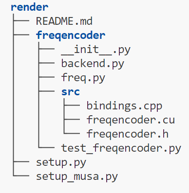

- [torch_musa utils](#torch_musa-utils)
  - [MUSAExtension](#musaextension)
    - [(可选) 在 *.cpp 文件中使用 half 类型的 MUSAExtension](#可选-在-cpp-文件中使用-half-类型的-musaextension)
  - [LOGGER](#logger)
  - [CMakeListsGenerator](#cmakelistsgenerator)
  - [SimplePorting](#simpleporting)
  - [比较与跟踪工具（Comparison and Tracking Tool）](#比较与跟踪工具comparison-and-tracking-tool)
    - [概览](#概览)
    - [特性](#特性)
      - [基础用法](#基础用法)
        - [与 CPU 的算子对比](#与-cpu-的算子对比)
        - [模块跟踪](#模块跟踪)
        - [NaN/Inf 检测](#naninf-检测)
      - [日志结构与解读](#日志结构与解读)
      - [异常发现后的处理](#异常发现后的处理)
      - [步数控制](#步数控制)
      - [分布式支持](#分布式支持)
    - [总结](#总结)
  - [musa-converter](#musa-converter)

# torch_musa utils

> **语言**: [English](README.md) | **中文**

## MUSAExtension

`MUSAExtension` 用于帮助第三方库构建基于 MUSA 的扩展，接口形式与 `CUDAExtension` 保持一致。  
需要注意两点：
- `extra_compile_args` 中使用 `mcc` 作为 key，而不是 `nvcc`；
- `cmdclass` 需要通过 `BuildExtension` 传入，该类从 `torch_musa.utils.musa_extension` 中导入。

下面是一个简单的 `MUSAExtension` 示例，其目录结构如下：



`setup_musa.py` 的内容为：

```python
import os
from setuptools import setup, find_packages
from torch_musa.utils.simple_porting import SimplePorting
from torch_musa.utils.musa_extension import MUSAExtension, BuildExtension

_src_path = os.path.dirname(os.path.abspath(__file__))

c_flags = []
if os.name == "posix":
    c_flags = {
        "cxx": ['-O3', '-std=c++14'],
        "mcc": ["-O2"]   
    }

# 将 .cu 迁移为 .mu
SimplePorting(cuda_dir_path="freqencoder/src", mapping_rule={
    "x.device().is_cuda()": "true",
    "#include <ATen/cuda/CUDAContext.h>": "#include \"torch_musa/csrc/aten/musa/MUSAContext.h\"",
    "#include <c10/cuda/CUDAGuard.h>": "#include \"torch_musa/csrc/core/MUSAGuard.h\"",
    }).run()

setup(
    name='freqencoder', # 包名称，用于导入 Python API
    ext_modules=[
        MUSAExtension(
            name='freqencoder._MUSAC', # 扩展名称，用于导入 MUSA API
            sources=[os.path.join(_src_path, 'freqencoder/src_musa', f) for f in [
                'freqencoder.mu',
                'bindings.cpp',
            ]],
            extra_compile_args=c_flags
        ),
    ],
    cmdclass={'build_ext': BuildExtension}
)
```

### (可选) 在 *.cpp 文件中使用 half 类型的 MUSAExtension

如果 `*.cpp` 代码中包含 `half`（即 float16）类型，如在 `musa_fp16.h` 中定义的那些，  
使用 `cxx` 编译器时会报错，提示无法识别 `half` 类型。  
原因在于这些头文件与 CUDA 版本有所不同，在使用 `cxx` 编译时缺少了一些必要的宏。

因此，与 `CUDAExtension` 略有不同，这里需要在 `extra_compile_args` 的 `cxx` 条目中引入名为 `force_mcc` 的参数，例如：

```python
c_flags = {
    "cxx": ["force_mcc", ...],
    "mcc": [...],
}
ext_modules=[
    MUSAExtension(
        name="xxx",
        sources=[...],
        extra_compile_args=c_flags,
    ),
    ...
]
```

这样即可使用 `mcc` 编译器来编译这些 `cpp` 文件。

## LOGGER

```python
from torch_musa.utils.logger_util import LOGGER

LOGGER.debug('debug')
LOGGER.info('info')
LOGGER.warning('warn')
LOGGER.error('error')
LOGGER.critical('critical')
```

## CMakeListsGenerator

```python
from torch_musa.utils.cmake_lists_generator import CMakeListsGenerator

CMakeListsGenerator(
    sources=["/path/to/xxx.mu", "/path/to/xxx.cpp"],
    include_dirs=["/path/to/include_dir"],
    link_libraries="/path/to/libxxx.so"
).generate()
```

## SimplePorting

```shell
python -m torch_musa.utils.simple_porting --cuda-dir-path cuda/
```

`SimplePorting` 会将转换后的文件输出到 `${cuda-dir-path}_musa` 目录中，因此执行上述命令后会生成一个名为 `cuda_musa` 的目录。  
如果需要更多自定义逻辑，可以参考 `simple_porting.py` 的实现。

完整命令示例：

```shell
python -m torch_musa.utils.simple_porting \
  --cuda-dir-path cuda/ \
  --ignore-dir-paths ["csrc/npu"] \
  --mapping-rule {"cuda":"musa"} \
  --drop-default-mapping \
  --mapping-dir-path mapping/
```

如果在 Windows 系统下，`{"cuda":"musa"}` 需要写成 `'{\\"cuda\\":\\"musa\\"}'`。

如果你希望在自己的代码中集成该功能，可以这样使用：

```python
from torch_musa.utils.simple_porting import SimplePorting

SimplePorting(cuda_dir_path, mapping_rule, drop_default_mapping, mapping_dir_path).run()
```

## 比较与跟踪工具（Comparison and Tracking Tool）

### 概览

该工具旨在增强 PyTorch 模型调试与验证的能力，提供跨设备的张量运算对比、模块层级跟踪以及 NaN/Inf 检测等功能，  
帮助在模型开发与测试的各个阶段保证正确性与稳定性。

### 特性

#### 基础用法

##### 与 CPU 的算子对比

将张量运算结果与 CPU 结果进行对比，以确保在不同设备上的一致性与正确性。  
这对自定义算子或特定设备实现的验证尤为关键。

```python
from torch_musa.utils.compare_tool import CompareWithCPU

model = get_your_model()
with CompareWithCPU(atol=0.001, rtol=0.001, verbose=True):
    train(model)
```

如果需要在调试或性能测试阶段临时关闭比较功能，可以使用 `enabled` 参数：

```python
with CompareWithCPU(enabled=False, atol=0.001, rtol=0.001, verbose=True):
    train(model)
```

##### 模块跟踪

在调试过程中，了解异常发生在哪一层模块与定位异常本身同样重要。  
通过开启模块跟踪，可以记录模块层级结构并定位问题所在：

```python
from torch_musa.utils.compare_tool import open_module_tracker, ModuleInfo

model = get_your_model()
open_module_tracker(model)
with CompareWithCPU(atol=0.001, rtol=0.001, verbose=True):
    train(model)
```

##### NaN/Inf 检测

尽管 `CompareWithCPU` 本身能够检测 NaN 和 Inf，但其需要在 CPU 上重新运行每一步运算，可能较慢。  
如果希望在不显著影响性能的前提下快速定位 NaN/Inf 出现的位置，可以使用完全在 GPU 上工作的 `NanInfTracker`：

```python
from torch_musa.utils.compare_tool import NanInfTracker

model = get_your_model()
with NanInfTracker():
    train(model)
```

#### 日志结构与解读

该工具会生成日志，详细记录被测试运算的输入、输出及比较结果，例如：

```text
2024-04-07, 15:11:10
-------------------------  step = 1  ----------------------
GeminiDDP/ChatGLMModel/torch.ops.aten.view(forward) is in white_list, pass
GeminiDDP/ChatGLMModel/torch.ops.aten.ones(forward) starts to run ...
GeminiDDP/ChatGLMModel/torch.ops.aten.ones(forward) succeeds to pass CompareWithCPU test
...

GeminiDDP/ChatGLMModel/GLMTransformer/GLMBlock/SelfAttention/Linear/torch.ops.aten.addmm(forward) starts to run ...
"addmm_impl_cpu_" not implemented for 'Half'
Convert to float32 ...

============================
[ERROR] GeminiDDP/ChatGLMModel/GLMTransformer/GLMBlock/SelfAttention/Linear/torch.ops.aten.addmm(forward) fails to pass CompareWithCPU test
....... input .........
0: Tensor <shape=torch.Size([6144]), dtype=torch.float16, device=musa:0, size=6144, >, 
1: Tensor <shape=torch.Size([24576, 5120]), dtype=torch.float16, device=musa:0, size=125829120, >, 
2: Tensor <shape=torch.Size([5120, 6144]), dtype=torch.float16, device=musa:0, size=31457280, >, 


...... output ........
Tensor <shape=torch.Size([24576, 6144]), dtype=torch.float16, device=musa:0, size=150994944, >

...... compare with cpu .......
Tensor values are not close

Too many indices (total 20581473) to print 

...

Element at index (0, 14) is not close: -0.84521484375(musa:0) vs -0.8450137972831726(cpu)
...
============================
```

- **算子详情**：日志中记录了每个算子的执行、输入/输出信息以及比较结果。  
- **错误识别**：针对算子输出不一致的情况，会清晰标记错误及差异。  
- **异常定位**：可以搜索 `"[WARNING]"` 来定位 NaN/Inf 出现的位置，搜索 `"[ERROR]"` 来定位未通过 CPU 对比的算子。

#### 异常发现后的处理

一旦检测到异常，可以结合以下策略进行排查与修复：

1. **仅隔离问题算子**

   将可疑算子加入 `target_list`，只对该算子做对比，从而加快调试效率：

   ```python
   from torch_musa.utils.compare_tool import CompareWithCPU, open_module_tracker

   model = get_your_model()
   open_module_tracker(model)
   with CompareWithCPU(atol=0.001, rtol=0.001, target_op=['torch.ops.aten.addmm']):
       train(model)
   ```

2. **调整误差容忍度**

   如果对比结果“几乎”通过却略微在阈值之外，可以适当调整 `atol` 与 `rtol`：

   ```python
   from torch_musa.utils.compare_tool import CompareWithCPU, open_module_tracker

   model = get_your_model()
   open_module_tracker(model)
   with CompareWithCPU(atol=0.01, rtol=0.01, target_op=['torch.ops.aten.addmm']):
       train(model)
   ```

3. **白名单机制**

   对于已经知晓、并可接受的差异，可以将对应算子加入 `white_list`，后续对比中忽略它：

   ```python
   from torch_musa.utils.compare_tool import CompareWithCPU, open_module_tracker

   model = get_your_model()
   open_module_tracker(model)
   with CompareWithCPU(atol=0.001, rtol=0.001, white_list=['torch.ops.aten.addmm']):
       train(model)
   ```

4. **调试与问题复现**

   针对意料之外的异常，可开启 `dump_error_data`，在首次对比失败时将异常算子的输入/输出保存下来，  
   便于后续以单算子形式进行单元测试复现：

   ```python
   from torch_musa.utils.compare_tool import CompareWithCPU, open_module_tracker

   model = get_your_model()
   open_module_tracker(model)
   with CompareWithCPU(
       atol=0.01,
       rtol=0.01,
       verbose=True,
       target_op=['torch.ops.aten.addmm'],
       dump_error_data=True,
       output_dir='path_to_save'
   ):
       train(model)
   ```

   使用保存的数据复现问题：

   ```python
   from torch_musa.utils.compare_tool import compare_for_single_op

   correct, args, kwargs, out = compare_for_single_op(
       'path_to_save/torch.ops.aten.addmm_inputs.pkl',
       torch.ops.aten.addmm,
       atol=0.01,
       rtol=0.01
   )
   ```

   对 NaN/Inf 检测也有类似接口：

   ```python
   from torch_musa.utils.compare_tool import nan_inf_track_for_single_op

   correct, args, kwargs, out = nan_inf_track_for_single_op(
       'path_to_save/torch.ops.aten.addmm_inputs.pkl',
       torch.ops.aten.addmm
   )
   ```

#### 步数控制

在 AMP 场景下，训练前几步可能因较大的缩放因子产生 NaN/Inf，从而干扰异常检测。  
可以通过设置 `start_step` 与 `end_step`，并在训练循环中调用 `step()` 来控制比较/检测启用的阶段：  
只有当 `start_step <= step_cnt < end_step` 时才会真正进行比较或 NaN/Inf 检测。

```python
from torch_musa.utils.compare_tool import open_module_tracker, ModuleInfo, CompareWithCPU

model = get_your_model()
open_module_tracker(model)
with CompareWithCPU(atol=0.001, rtol=0.001, verbose=True, start_step=5) as compare_with_cpu:
    for epoch in range(epoch_num):
        for step in range(step_num):
             train_step(model)
             compare_with_cpu.step()
```

#### 分布式支持

`CompareWithCPU` 与 `NanInfTracker` 原生支持分布式场景。  
可以使用 `should_log_to_file` 避免多卡之间的日志互相干扰：

```python
from torch_musa.utils.compare_tool import open_module_tracker, ModuleInfo, CompareWithCPU

model = get_your_model()
open_module_tracker(model)
with CompareWithCPU(
    atol=0.001,
    rtol=0.001,
    verbose=True,
    should_log_to_file=True,
    output_dir='path_to_save'
):
    train(model)
```

此外，可以通过 `enable_ranks` 控制仅在特定 rank 上启用 `CompareWithCPU` 与 `NanInfTracker`，  
避免所有 rank 同时占用 CPU 做对比，提升多卡场景下的整体性能：

```python
from torch_musa.utils.compare_tool import open_module_tracker, ModuleInfo, CompareWithCPU

model = get_your_model()
open_module_tracker(model)
with CompareWithCPU(
    atol=0.001,
    rtol=0.001,
    verbose=True,
    should_log_to_file=True,
    output_dir='path_to_save',
    enable_ranks=[0]
):
    train(model)
```

### 总结

比较与跟踪工具是 PyTorch 模型开发与调试中的重要组件，通过以下能力帮助构建稳定可靠的模型：

- **与 CPU 的运算结果对比**：确保自定义算子或特定设备实现与 CPU 基准行为一致，是跨硬件部署时的重要保障。  
- **模块结构跟踪**：通过记录模块层级结构，帮助开发者在复杂网络中快速定位问题来源并理解数据流向。  
- **NaN/Inf 检测**：在 GPU 上高效排查数值不稳定问题，兼顾性能与调试效率。  
- **异常后的处理策略**：支持算子隔离、容差调整、白名单以及错误数据导出等多种手段，覆盖从“发现问题”到“复现并修复”的完整链路。  
- **步数与分布式控制**：可以按训练阶段精细控制工具启用范围，并友好地支持多 GPU / 分布式环境。

综合来看，该工具为 PyTorch 模型开发者与研究者提供了一套功能完备且灵活易用的调试与验证方案，有助于在复杂场景下构建高可靠、高性能的模型。

## musa-converter

`musa-converter` 旨在将基于 CUDA 的 PyTorch 脚本中的相关字符串与 API 转换至 MUSA 平台，从而提升模型从 CUDA 迁移到 MUSA 的效率。  

```shell
musa-converter -r ${/path/to/your/project} -l ${/path/to/your/project_launch_script}
```

运行 `musa-converter -h` 可以查看各输入参数的详细说明。

